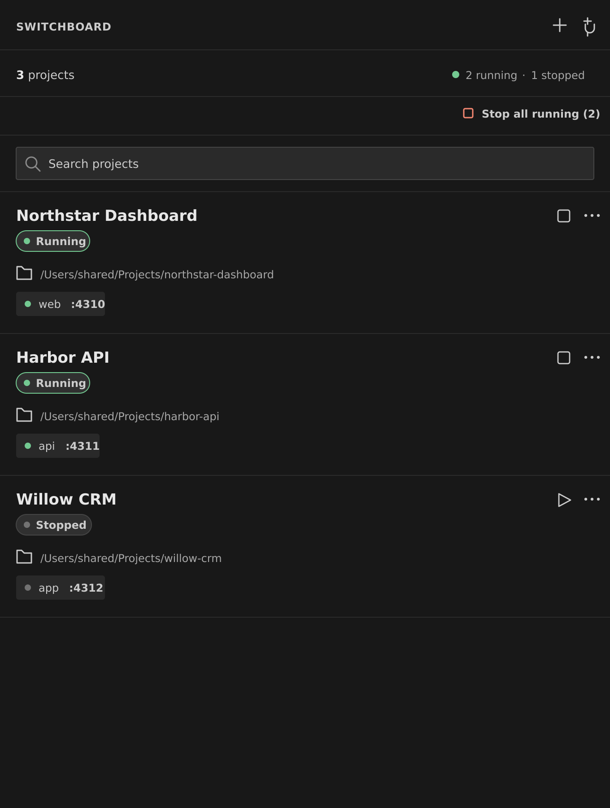

  
  <h1>Switchboard</h1>
  
<strong>Every local app, across every repository, in one focused VS Code control panel.</strong>

  
Save each project's folder and commands once, then start, stop, inspect, and open it from the sidebar.

  

    
  

---

  

## A control panel for local projects

Switchboard keeps a reusable list of local projects from different repositories inside VS Code. It combines saved commands with project status, cautious port checks, quick links, and recent output, so it is more than a list of tasks to run.

- Start projects with their saved commands and safely stop the process trees Switchboard launched.
- Search saved projects by name or folder.
- Give projects a friendly name without renaming their folders.
- Keep configured service names and ports visible at a glance.
- When service ports are configured, see project status and open the first local service in your browser.
- Open any saved project folder in a new VS Code window.
- View readable recent output from the latest run, follow new lines, and open web links without leaving the sidebar.
- Edit or remove a saved project without touching its files.

> Switchboard remembers the setup. You decide what runs.

## Download and install

Switchboard is tested on Windows, macOS, and Linux.

### 1. Download Switchboard

Download version 0.0.1 here:

**[Download Switchboard 0.0.1](https://github.com/HSwart/Switchboard/releases/download/v0.0.1/switchboard.vsix)**

### 2. Install it in VS Code

1. Open the **Extensions** view in VS Code.
2. Select the **…** menu at the top of the Extensions view.
3. Choose **Install from VSIX…**.
4. Select the `switchboard.vsix` file you downloaded.
5. Reload VS Code when prompted.

After installation, select the Switchboard icon in the VS Code Activity Bar.

## Add your first project

1. Select the **+** button in the Switchboard sidebar.
2. Optionally enter a friendly project name. If you leave it blank, Switchboard uses the folder name.
3. Choose the project folder.
4. Enter the command that starts the project.
5. If the project needs a special shutdown workflow, optionally enter a custom stop command. Most projects should leave this blank.
6. If you know it, enter the app's port so Switchboard can verify its status and open it in your browser.
7. Save it.

Switchboard points out missing or invalid details beside the field that needs attention. If you close the screen after making changes, it asks before discarding them.

Your project is now ready whenever you need it. Select the **Start** icon to run its saved start command and the **Stop** icon to stop the process tree Switchboard launched. Projects with an explicit custom stop command use that command instead. While a command is being handled, the project clearly shows **Starting…** or **Stopping…**.

If Switchboard is open in more than one VS Code window, starting or stopping a project in one window updates its status in the others automatically.

Configured ports are lightweight service details, not a port-management system. Projects may save the same app port because they can still run at different times. Switchboard points this out while you add or edit a project, checks the port again before starting, and blocks the start if another app is already using it.

If another Switchboard project owns the port, Switchboard names it. If a shared port is occupied but its owner cannot be identified safely, both Start and Stop remain unavailable until the port is free. Switchboard never changes ports or stops an unknown process automatically.

You can set up every project yourself. If you prefer, the optional coding-agent setup below can inspect a project and propose its commands and service ports for your approval.

## Optional: set up a project with your coding agent

Switchboard can also give a supported coding agent a guided setup skill. The agent inspects the project, finds its existing commands and service ports, and saves the result through Switchboard.

1. Select the **plug** button beside the **+** button to open **Agent connections**.
2. Select **Set up** beside the agent you use.
3. Restart Codex after setup. If an already-open Claude Code session does not find the new skill, restart it too.

Then open the project with your agent and use its Switchboard skill:

| Agent | What to use |
| --- | --- |
| **GitHub Copilot** | `/switchboard` in Copilot CLI, or ask Copilot agent mode to set up the project in Switchboard. |
| **Codex** | `$switchboard` |
| **Claude Code** | `/switchboard` |

You can also describe what you want naturally. For example:

> Inspect this project and add it to Switchboard with the name My App. Identify the exact start command and the port for every service it runs. Include a custom stop command only if it needs a special shutdown workflow.

The agent can propose a new project or an update to one already in Switchboard. The project then shows **Review setup** in the sidebar. Check its folder and exact commands, then select **Approve setup** before Start or Stop becomes available. Agent-proposed commands never run without this approval.

After updating Switchboard, return to **Agent connections** and select **Refresh setup** so the agent uses the current connection and skill. Switchboard will not replace a different skill you created with the same name.

## Day-to-day use

Switchboard keeps the everyday controls simple:

| Control | What it does |
| --- | --- |
| **Search** | Filters your saved projects by project name or folder. |
| **Project status** | Shows the written state in a clear status capsule, including running, stopped, transitions, and port conflicts. Long names, status details, and folder paths scroll automatically when they do not fit. |
| **Start icon** | Runs the saved start command inside the project folder. |
| **Stop icon** | Stops the process tree Switchboard launched, or runs an explicitly configured custom stop command. |
| **Stop all running** | Appears when two or more projects are running and stops them together. |
| **Port in use** | Prevents conflicting projects from starting and identifies the owning project when possible. |
| **View output** | Highlights common log levels, opens web links, and lets you copy output from the latest run. If you scroll up, Switchboard keeps your place and offers a **Latest** button when new output arrives. |
| **…** | Opens the app, project folder, recent output, edit screen, or remove action. |

Removing a project from Switchboard does **not** delete the project or any of its files.

If Switchboard finds a configured service already running but did not start it itself, the project is labelled **Detected running** so its state is clear.

## Your projects stay local

Switchboard stores its project list in your local VS Code data. Switchboard itself does not upload project folders, commands, or service ports. Any coding agent you connect has its own data and privacy settings.

## Security

Found a possible security issue? Please read the [security policy](SECURITY.md) and report it privately. Do not share sensitive details in a public issue.

Switchboard is available under the [MIT License](LICENSE).

---

  
<strong>Spend less time remembering commands. Spend more time building.</strong>

  
<a href="https://github.com/HSwart/Switchboard/releases/download/v0.0.1/switchboard.vsix">Download Switchboard 0.0.1</a>

