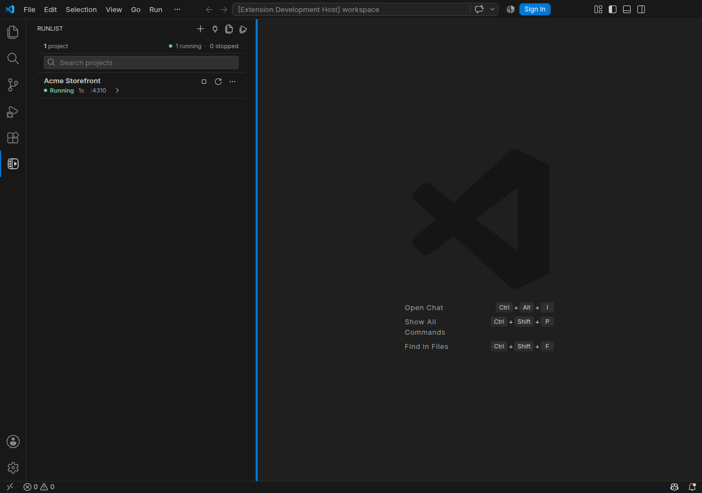

  
  <h1>Runlist</h1>
  
<strong>Every local app, across every repository, in one focused VS Code control panel.</strong>

  
Save each project's folder and commands once, then start, stop, inspect, and open it from the sidebar.

  
Set projects up yourself—or optionally let a supported coding agent propose the setup for your approval. Runlist checks configured ports before start and asks before closing an external process to free one.

---

  

## A control panel for local projects

Runlist keeps a reusable list of local projects from different repositories inside VS Code. It combines saved commands with project status, cautious port checks, quick links, and recent output, so it is more than a list of tasks to run.

- Start projects with their saved commands and safely stop the process trees Runlist launched.
- Keep alternate launch profiles for projects that need different commands or service sets, and choose one from the existing Start controls.
- Search saved projects by name, folder, or tag, and use the compact Tags disclosure to filter the list.
- Pin important projects so they stay at the top of the list.
- Give projects a friendly name without renaming their folders.
- Keep configured service names and local addresses visible at a glance.
- When another Runlist-owned project needs the same port, switch safely by stopping it before starting the selected project.
- When an external process owns a configured port, review its service, process name, and PID in a native confirmation before closing it or closing it and starting the selected project.
- When service ports are configured, see project status, copy a responding web service's URL, and open the first service at its localhost address or optional HTTP/HTTPS URL. Services with an Open URL are also checked for an HTTP response.
- Expand a running web app into stable Overview, Output, Preview, and History tabs, with refresh, copy, and browser actions.
- Open an eligible responding local web app on a phone by scanning a QR code generated entirely on your computer.
- See current CPU and memory use for the process tree Runlist started while its project details are expanded.
- Open any saved project folder in a new VS Code window.
- Expand a starting or running project to follow its startup timeline and the latest three useful output lines, then open the complete Recent Output screen when you need more detail.
- View readable recent output from the latest run, including a concise failure summary when startup exits, follow new lines, and open web links without leaving the sidebar.
- After a failed start, prepare a bounded, sanitized diagnosis request for a connected coding agent without sending anything automatically.
- Export one or all project setups, or import a file after a preview; imported changes stay blocked until you review and approve them.
- Save run groups to start members sequentially in saved order or launch them in parallel; if one fails, Runlist rolls back only the projects that group run started, in reverse order.
- Edit or remove a saved project without touching its files.

> Runlist remembers the setup. You decide what runs.

## Install

Runlist is tested on Windows, macOS, and Linux.

### Install from the VS Code Marketplace

[Install Runlist from the VS Code Marketplace](https://marketplace.visualstudio.com/items?itemName=hankoswart.runlist), or install it from VS Code:

1. Open the **Extensions** view in VS Code.
2. Search for **Runlist**.
3. Confirm that the publisher is **Hanko Swart** and the extension ID is `hankoswart.runlist`.
4. Select **Install**.

After installation, select the Runlist icon in the VS Code Activity Bar.

## Add your first project

1. Select the **+** button in the Runlist sidebar.
2. Optionally enter a friendly project name. If you leave it blank, Runlist uses the folder name.
3. If a local folder is already open in VS Code, choose **Use current workspace**, or select **Browse**. In a multi-root workspace, Runlist asks which local workspace folder to use.
4. Enter the command that starts the project.
5. If the project needs a special shutdown workflow, optionally enter a custom stop command. Most projects should leave this blank.
6. If you know them, add each service name and port so Runlist can verify its status. In **Options**, you can add an HTTP or HTTPS Open URL and optionally choose a port-only or configurable HTTP health check.
7. Save it.

Runlist points out missing or invalid details beside the field that needs attention. If you close the screen after making changes, it asks before discarding them.

Use the optional comma-separated Tags field to group projects by role, team, or workflow. Tags are edited with the project, while the list keeps them in one on-demand filter instead of adding another row to every card.

Your project is now ready whenever you need it. Select the **Start** icon to run its saved start command. Projects with configured services stay **Starting…** until every saved TCP port is accepting IPv4 or IPv6 loopback connections. A service with an Open URL also waits for its web page to respond; redirects, sign-in responses, and error pages still count as a response. After 30 seconds, Runlist shows **Taking longer…** and names the services it is still checking, without stopping the project or giving up. If those services become ready later, the status changes to **Running**. A service whose port is open but whose page does not respond is shown separately as **Web service not responding**. Services without an Open URL keep using port-based checks. Projects without configured services use the launched process state. Select **Stop** to stop the process tree Runlist launched. When Runlist cannot use normal ownership but configured ports are open, Stop offers a native confirmation before closing the exact current listener processes. When an explicit custom stop command is configured, Runlist first shows the exact user-controlled command for confirmation, runs it once with a timeout, and verifies that the tracked process and configured services stopped. A failed or partial custom stop never triggers another command or additional process termination automatically. Folder or custom-stop edits made during a run apply on the next Start.

Service health checks stay under **Options**. **Default** preserves the behavior above, **Port only** ignores HTTP readiness even when an Open URL exists, and **HTTP request** can use a separate URL or `/path`, HEAD or GET, an optional exact status, a bounded timeout, and up to two retries. Health failures change readiness only; they never stop a process or close a port.

Project cards keep services in one compact summary. Open **Services** to inspect each saved service, its current readiness and address, then reveal only the service whose Open, Copy URL, or Resolve Port control you need. Project Start, Stop, and Restart remain ownership-scoped to the exact project process Runlist launched.

For projects with more than one way to run, add alternate launch profiles in **Edit project**. Each profile keeps its own start command, optional custom stop command, and services. A compact selector appears beside Start only when alternatives exist. Choosing a profile never starts it, and Runlist locks profile switching while the project is running so the launch-time setup remains unambiguous.

If Runlist is open in more than one VS Code window, starting or stopping a project in one window updates its status in the others automatically.

Reloading or closing the VS Code window waits for Runlist to stop the projects that window launched, using their saved custom stop commands when configured. If the window exits unexpectedly and ownership can no longer be verified, Runlist shows **Running — control unavailable**. For a process Runlist did not launch, a configured custom stop command remains an explicit, user-confirmed shutdown path. **Close configured ports…** remains a separate confirmed action in the project's More actions menu whenever a configured port is open.

Configured service ports remain lightweight service metadata. Projects may save the same service ports because they can still run at different times. Runlist points this out while you add or edit a project and checks every configured port again before starting. A detected external listener does not prevent correcting the saved service metadata; verified or ownership-uncertain Runlist processes still lock those fields until they stop.

If another live Runlist project owns every occupied port, Runlist names it and uses the normal safe handoff. Mixed conflicts or ports owned by several Runlist projects must be stopped in Runlist before external listeners can be closed. For an external or ownership-lost process, Start or Stop resolves the exact current listeners and shows their service ports, process names, and PIDs in a native confirmation. After confirmation, Runlist revalidates each process identity before termination; if the owner changed, nothing is stopped. Runlist never changes a saved port or closes a process automatically.

Lifecycle controls are supported for projects running on the same local host as Runlist on Windows, macOS, and Linux. In Remote SSH, WSL, Dev Containers, Codespaces, VS Code Tunnels, or a Windows WSL network path, Runlist does not probe or act on the local machine's unrelated ports; the project shows **Local lifecycle only** instead.

You can set up every project yourself. If you prefer, the optional coding-agent setup below can inspect a project and propose its commands, service ports, and explicitly documented browser URLs for your approval.

## Optional: set up a project with your coding agent

Runlist can also give a supported coding agent a guided setup skill. The agent inspects the project, finds its existing commands, service ports, and explicit browser URLs, and saves the result through Runlist.

1. Select the **plug** button beside the **+** button to open **Agent connections**.
2. Select **Set up** beside the agent you use.
3. Restart Codex after setup. If an already-open Claude Code session does not find the new skill, restart it too.

Then open the project with your agent and use its Runlist skill:

| Agent | What to use |
| --- | --- |
| **GitHub Copilot** | `/runlist` in Copilot CLI, or ask Copilot agent mode to set up the project in Runlist. |
| **Codex** | `$runlist` |
| **Claude Code** | `/runlist` |

You can also describe what you want naturally. For example:

> Inspect this project and add it to Runlist with the name My App. Identify the exact start command and the port for every service it runs. Preserve any explicit HTTP or HTTPS browser URLs, and include a custom stop command only if the project daemonizes or manages external services such as Docker or databases.

The agent can propose a new project or an update to one already in Runlist. The project then shows **Review setup** in the sidebar. Check its folder and exact commands, then select **Approve setup** before Start or Stop becomes available. Agent-proposed commands never run without this approval.

When a start fails, open **View output** and select **Ask your agent**. Runlist first shows exactly which saved details and retained output the agent can retrieve. Select **Copy diagnosis request**, then paste it into your agent chat. Nothing is sent automatically. If the agent prepares a repair proposal, select **Refresh proposal** to compare every current and proposed setup field, then approve or reject the complete change. Approval saves the setup but does not run it; **Retry start** remains a separate action.

After updating Runlist, return to **Agent connections** and select **Refresh setup** so the agent uses the current connection and skill. Runlist will not replace a different skill you created with the same name.

## Day-to-day use

Runlist keeps the everyday controls simple:

| Control | What it does |
| --- | --- |
| **Search** | Filters your saved projects by project name, folder, or tag. |
| **Running app navigator** | When multiple running project cards do not fit in the visible sidebar, a compact navigator lets you move between them and shows one live thumbnail for the selected web app. It stays hidden for short lists. Use the Open button—or double-click the thumbnail—to open that responding app in your browser. |
| **Pin to top** | In a project's More actions menu, keeps that project above unpinned projects until you unpin it. |
| **Project status** | Shows the written state in a clear status capsule, including running, stopped, transitions, a slow-starting service, a web service that is not responding, and port conflicts. When startup takes longer, Runlist names the services that are ready and the ones it is still checking. Long names, status details, and folder paths scroll automatically when they do not fit. |
| **Start icon** | Runs the saved start command inside the project folder. If an external process blocks a configured port, asks before closing the exact listener and continuing Start. |
| **Stop icon** | Stops the process tree Runlist launched, asks before running the exact optional custom stop command, or asks before closing exact external listeners on the project's configured ports. |
| **Close configured ports…** | Shows the current process names, ports, and PIDs for confirmation before closing those exact listeners. |
| **Restart** | In a project's More actions menu, safely stops that project before starting it again and checking service readiness. |
| **Stop all running** | Appears when two or more projects are running and stops them together. |
| **Run groups** | Saves a small ordered set of projects. Choose Sequential to wait for each project or Parallel to launch the eligible members together. Failure rollback and Stop group use reverse order and stop only Runlist-owned processes. |
| **Port in use** | Identifies the owning project when possible and requires confirmation before an external listener is closed. |
| **Switch projects** | When two Runlist-owned projects need the same port, safely stops the running project before starting the selected one. For external listeners, shows the exact processes and asks before closing them and continuing Start. |
| **Resolve service port…** | Appears on only the affected service when one port blocks a multi-service project or stays unavailable after startup. Retry, review and close that exact listener, safely switch Runlist projects, or enter the service's port variable and use a temporary port on the fly. Runlist verifies the selected port opened and stops its launched process tree if the command rejected the override. The variable and port last for the current launch, leave the saved project unchanged, and are preserved by Restart. |
| **Service addresses** | Shows every service's local address and written state, such as Ready, Waiting, No web response, Port in use, or Stopped. Temporary launches show both the effective port and the unchanged saved port. |
| **Copy URL** | Appears beside the responding first service, and beside other responding services with an Open URL. It copies the same safe full URL Runlist would open. |
| **Preview app** | A chevron appears at the far right when any configured web service responds, even while another service is still starting. Runlist uses the first responding web service in the saved order. Expand the row and use its Preview tab to load one live preview. Some apps block embedded views, so Open in browser remains available. |
| **Open on phone** | In Preview, shows a local QR code and exact private-network URL when Runlist can safely derive one. Your phone must be on the same network, and the app must allow local network connections. |
| **Runtime pulse** | Shows current CPU, memory, and the latest HTTP response time in Overview. CPU and memory are measured when this VS Code window started the project; HTTP timing reuses Runlist's existing local health check. Samples stay in memory only while the project details are open. |
| **Recent starts** | Shows up to five completed Runlist-managed starts in History, including average ready time, whether each became ready, failed, or was still starting after the readiness timeout. Select a failed start when available to see its short, sanitized failure reason; full logs remain in Recent Output. |
| **Expand details** | Keeps startup progress and runtime information in Overview, bounded live lines in Output, the app in Preview, and past outcomes in History. The stable workspace prevents growing output or history from pushing the preview around. **View output** opens the complete retained output. |
| **View output** | Summarizes a failed start above the unchanged raw log, highlights common log levels, opens web links, and lets you copy output from the latest run. If you scroll up, Runlist keeps your place and offers a **Latest** button when new output arrives. |
| **Ask your agent** | Appears only for a retained failed start. It copies a request that lets a connected agent retrieve bounded, sanitized diagnostics for that one project through Runlist. |
| **Import or export** | Uses a JSON file to move one or all saved setups. Runlist previews additions, updates, skipped entries, and invalid entries before import; changed commands require review before they can run. Exported files include saved command text, so store and share them carefully. |
| **…** | Opens the app or project folder, opens a terminal in that folder, copies the saved project path, and provides recent output, edit, or remove actions. |

Removing a project from Runlist does **not** delete the project or any of its files.

If Runlist finds a configured service already running but did not start it itself, the project is labelled **Detected running**. Without a custom stop command, its Stop control asks for confirmation before closing the exact processes listening on that project's configured ports. The same confirmed action remains directly available under **Close configured ports…** when a custom stop command exists.

## Contributing

Run the isolated VS Code extension-host smoke suite with `npm run test:smoke`. The first run downloads a VS Code test runtime when a supported local installation is not available.

## Your projects stay local

Runlist stores its project list in your local VS Code data. Runlist itself does not upload project folders, commands, service ports, or URL overrides. Any coding agent you connect has its own data and privacy settings.

## Security

Found a possible security issue? Please read the [security policy](SECURITY.md) and report it privately. Do not share sensitive details in a public issue.

Runlist is available under the [MIT License](LICENSE).

---

  
<strong>Spend less time remembering commands. Spend more time building.</strong>

