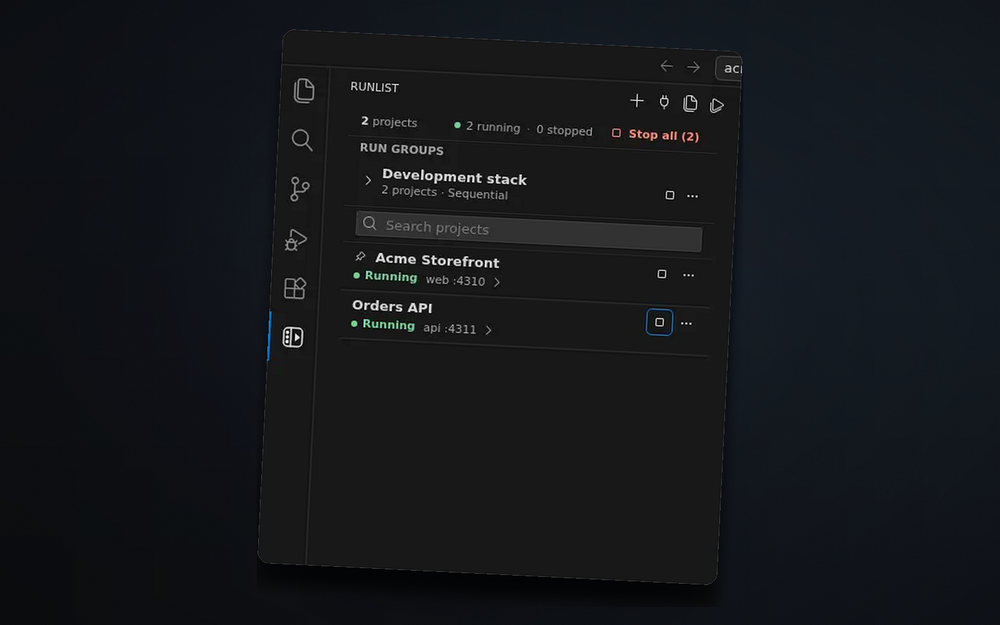
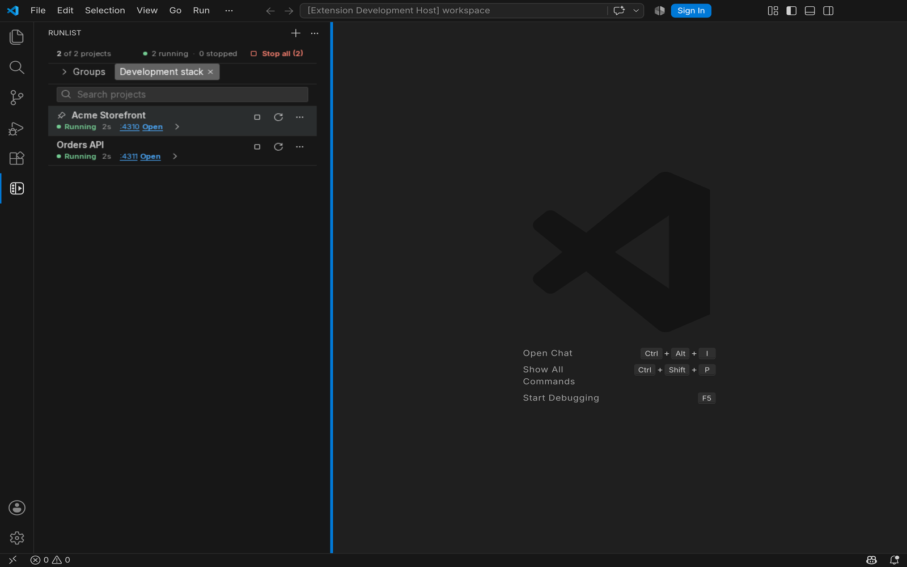
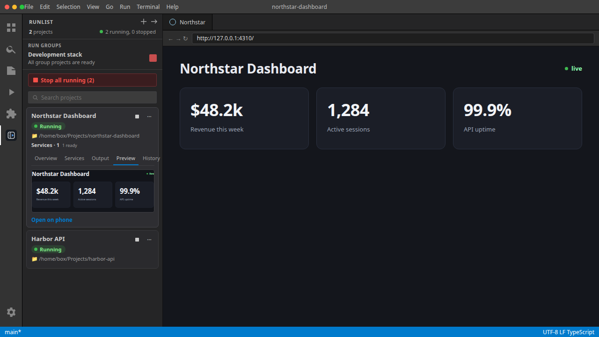

# Runlist

**A VS Code sidebar for starting, stopping, and opening local dev apps.**

Start, stop, and switch local apps from one sidebar.

- Every local app, one sidebar
- Save the start command once
- See what’s running, stop or restart from the row
- Open the app from its port, or switch when a port is already in use

## Get started

1. Install from the [VS Code Marketplace](https://marketplace.visualstudio.com/items?itemName=hankoswart.runlist).
2. Open the Runlist sidebar
3. Add this folder
4. Save the start command — or pick a `start` / `dev` chip when your folder already has one
5. Start it from the list

See what’s running. Stop, restart, or open it from here.

First-run stays empty until you add a folder. No setup dump.

## Everyday use

- Start, stop, and restart from the running row
- Port chip opens the app; turn on **Named localhost** from ⋯ to use `name.localhost` (falls back to `localhost:port`); readiness still tracks the real port
- Checks configured ports before a start, and helps you switch when another Runlist app owns the port
- Live preview, recent output, and open-on-phone handoff for local web apps (phone handoff uses your LAN address; named `.localhost` URLs are for this machine)
- Start runs in a VS Code terminal named after the project; Stop ends the process and keeps the tab
- Windows, macOS, and Linux

## Power features

- **Launch profiles, tags, and run groups** for the apps you keep coming back to
- **Named localhost toggle** on a running web row (default off); collisions get `-2`. Not a local reverse proxy — no Portless/Caddy parity
- **Debug** attaches VS Code’s debugger to a Runlist-started process from ⋯ without restarting
- **Share off LAN** uses VS Code’s own tunnel/port-forward through a Runlist proxy; Stop or toggle off closes that proxy so the URL stops serving
- **Requests** tab lists inbound HTTP to a Runlist-started web port while observation is available (hidden otherwise)
- **Git worktree sticky ports** — git worktrees with port variables get sticky temporary ports per worktree (saved baseline ports stay put); non-git folders keep current behavior
- **Launch environment** — optional env file (path relative to the project folder) and non-secret env overrides per project or launch profile; Start fails closed if a configured env file is missing; temporary port variables still win; values are redacted from Recent Output, diagnostics, and agent diagnosis
- **Port diagnosis and safe recovery** — What’s Listening lists configured project ports and their listeners; closing a listener always asks for confirmation with the exact port and PID, then checks identity again before stopping anything. Running rows show conflict status when a port is blocked.
- **Import or export project setups**, then review changes before they can run
- **Stack contract** — optional `runlist.json` (or `.runlist/projects.json`) stack file in a repo: load or export from Import or Export, review before commands can run; may reference an `envFile` path, but keep secret values out of the file (use `.env.example` in git and a local `.env` for real secrets)
- **Docker Compose** — folder-root Compose files add one Start/Stop row per service (`up --no-deps`); Import Compose services after review still available for a combined project. Needs Docker Engine + Compose v2

Publisher Hanko Swart. `hankoswart.runlist`.
